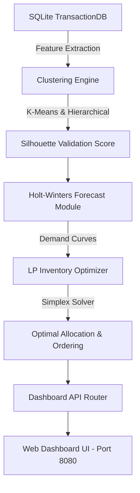

# 🛍️ Retail Demand Intelligence & Inventory Optimization System

[](https://www.oracle.com/java/)
[](https://maven.apache.org/)
[](https://www.sqlite.org/)
[](LICENSE)

An end-to-end **Intelligent Retail Demand Forecasting, ML Clustering, & Linear Programming (LP) Inventory Optimization Engine** built in Java 17 with an interactive web-based dashboard and SQLite database integration.

---

## 🌟 Overview

Modern retail operations require accurate demand forecasting and optimal inventory allocation under budget and capacity constraints. This system implements an end-to-end automated analytics pipeline:

1. **Transactional Data Store**: Seed & manage sales transactions using SQLite.
2. **Machine Learning Clustering**: Groups SKUs into distinct velocity tiers using **K-Means** & **Hierarchical Clustering** with **Silhouette Score** validation.
3. **Time-Series Demand Forecasting**: Predicts future demand per cluster using **Holt-Winters Exponential Smoothing** (Level, Trend, & Seasonality).
4. **Linear Programming Inventory Optimization**: Solves constrained stock allocation using **Apache Commons Math SimplexSolver**.
5. **Interactive Web Dashboard**: Embedded HTTP server rendering real-time telemetry, interactive pipeline triggers, and cluster insights.

---

## 🏗️ System Architecture



---

## ✨ Key Features

- **🤖 Dual Machine Learning Clustering**:
  - Implements both K-Means and Agglomerative Hierarchical clustering on SKU price, volume, and velocity metrics.
  - Automatically calculates Silhouette coefficients to evaluate cluster separation.
- **📈 Holt-Winters Time-Series Forecasting**:
  - Triple exponential smoothing capturing baseline level, trend, and seasonal index adjustments.
- **⚖️ Linear Programming (LP) Stock Allocation**:
  - Powered by Apache Commons Math `SimplexSolver` to maximize total expected revenue under target budget constraints.
- **⚡ Lightweight Embedded Server & Dashboard**:
  - Built-in Java HTTP server with custom REST API routers serving a dark-themed SPA (Single Page Application).
  - Real-time latency tracking, health status checks, and dynamic parameter tuning (e.g., custom budget limits).
- **📊 System Presentation Included**:
  - Comes with `Retail Demand Full System - Enhanced.pptx` deck presenting system design, architecture diagrams, and operational workflows.

---

## 📁 Repository Structure

```text
retail-demand-java/
├── public/                       # Frontend SPA assets
│   ├── index.html                # Main dashboard UI
│   ├── style.css                 # Dark theme styling & animations
│   └── app.js                    # Interactive charts & API handling
├── src/main/java/retail/         # Core Java Backend Architecture
│   ├── Main.java                 # Entry point & bootstrap launcher
│   ├── DashboardServer.java      # Embedded HTTP Server (Port 8080)
│   ├── ApiRouter.java            # REST endpoint handlers & routing
│   ├── TransactionDB.java        # SQLite database connection & seed data
│   ├── SkuFeature.java           # SKU feature data structure & normalizer
│   ├── ClusteringEngine.java     # K-Means, Hierarchical & Silhouette ML algorithms
│   ├── ForecastModule.java       # Holt-Winters time-series forecaster
│   ├── InventoryOptimizer.java   # Apache SimplexSolver LP algorithm
│   ├── PipelineService.java      # Pipeline orchestrator & cache manager
│   └── ReportingModule.java      # Console output formatter
├── OPERATIONAL_GUIDE.md          # Complete operational & execution guide
├── Retail Demand Full System - Enhanced.pptx # System architecture deck
├── pom.xml                       # Maven build file & dependencies
└── README.md                     # Project documentation
```

---

## 🚀 Getting Started

### Prerequisites
- **Java Development Kit (JDK)**: Version 17 or higher
- **Apache Maven**: Version 3.8+
- **Git**

### 1. Clone the Repository
```bash
git clone https://github.com/Abhinav-858/retail-demand-java.git
cd retail-demand-java
```

### 2. Build the Project
Compile and package the application into a standalone fat/uber JAR using Maven:
```powershell
mvn clean package -DskipTests
```
This builds `target/retail-demand-system.jar`.

### 3. Run the Server
Launch the application:
```powershell
java -jar target/retail-demand-system.jar
```
*The server will start on port `8080`.*

### 4. Access the Dashboard
Open your browser and navigate to:
👉 **[http://localhost:8080](http://localhost:8080)**

---

## 🔌 API Endpoints

| Endpoint | Method | Description |
| :--- | :--- | :--- |
| `/` | `GET` | Serves the web dashboard static SPA (`index.html`) |
| `/api/health` | `GET` | Server health, database connectivity status & uptime |
| `/api/system-status` | `GET` | System configuration, cache telemetry, and endpoint latencies |
| `/api/run-pipeline` | `POST` | Triggers the ML clustering, forecasting & LP optimization |
| `/api/sku-details` | `GET` | Retrieves SKU cluster assignments & demand metrics |

---

## 📊 Presentation & Documentation

- 📘 **[OPERATIONAL_GUIDE.md](OPERATIONAL_GUIDE.md)**: In-depth instructions for running, managing, rebuilding, and inspecting system metrics.
- 📙 **`Retail Demand Full System - Enhanced.pptx`**: Slide deck detailing full system architecture, algorithms, and results.

---

## 🛠️ Built With

- **Java 17**: Core application language
- **Apache Commons Math 3.6.1**: SimplexSolver for Linear Programming
- **SQLite JDBC 3.45.1**: Embedded relational database
- **Google Gson 2.10.1**: Fast JSON serialization
- **HTML5 / CSS3 / JavaScript (ES6+)**: Responsive dashboard frontend

---

## 📄 License

Distributed under the MIT License. See `LICENSE` for details.
